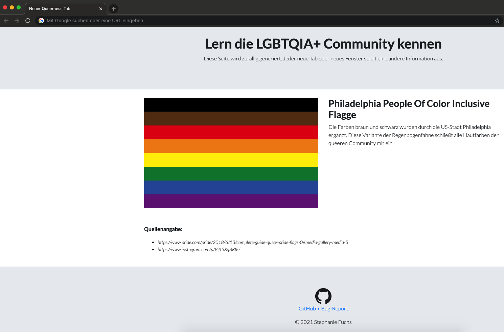

# Get to know the LGBTQIA+ community

This extension will change the page for a new tab / new page in _Google Chrome_ (version >= 88). It uses
the [Manifest V3](https://developer.chrome.com/docs/extensions/mv3/intro/). Does not work for Smartphones.

Every tab/window (`chrome://newtab/`) will generate a random queer information page, so you maybe a page appears, you'll
already knew and maybe not. Kinda fun, huh?

## Installation

Currently this extension is not available in the Chrome Webstore. But will soon.

In the mean time you can add it manually to chrome. That means, you have to download it first. Go
to [Releases](https://github.com/stephfuchs/queer-custom-chrome-tab/releases) and download the latest version to your
Computer.

1. Open the Extension Management page by navigating to `chrome://extensions`. The Extension Management page can also be
   opened by clicking on the Chrome menu, hovering over **More Tools** then selecting **Extensions**.
1. Enable Developer Mode by clicking the toggle switch next to **Developer mode**.
1. Click the **LOAD UNPACKED** button and select the extension directory.

That's it. You can now open a new tab or new window. There will be a popup which asks you whether you want to replace
the template. Just choose "yes" and it will update.

## Content

This content is a result of researches. All sources will be noticed, so you can inform yourself, if you want to.

### Updates

Because the community is huge so is the data to collect. That is why, there will be updates with more queer-information.
So stay tuned.

## Frontend

The content is generated dynamic by JavaScript (based on
ES6 ([ECMAScript 2015](https://www.w3schools.com/js/js_es6.asp)) and a random output. The template is based on jumbotron
by [Bootstrap 4.6](https://getbootstrap.com/docs/4.6/getting-started/introduction/). All flags
are [SVG](https://www.w3schools.com/graphics/svg_intro.asp) files.

## Translation

The translation is based on the `chrome.i18n.getUILanguage()` function
by [Chome API](https://developer.chrome.com/docs/extensions/reference/)  The default language will be `en`.

### list of available languages:

- `de` (incl: `de-DE`, `de-CH`, `de-AT`)
- `en`

## See also

- [License](https://github.com/stephfuchs/queer-custom-chrome-tab/LICENSE)
- [Read me](https://github.com/stephfuchs/queer-custom-chrome-tab/README.md)
- [Issue Tracker](https://github.com/stephfuchs/queer-custom-chrome-tab/issues)
